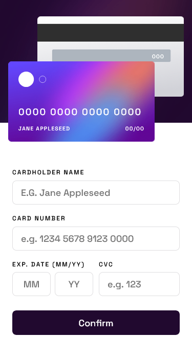

# Interactive card details form solution

This is a solution to the [Interactive card details form challenge on Frontend Mentor](https://www.frontendmentor.io/challenges/interactive-card-details-form-XpS8cKZDWw). Frontend Mentor challenges help you improve your coding skills by building realistic projects.

## Table of contents

- [Overview](#overview)
  - [The challenge](#the-challenge)
  - [Screenshot](#screenshot)
  - [Links](#links)
- [My process](#my-process)
  - [Built with](#built-with)
  - [What I learned](#what-i-learned)
- [Author](#author)

## Overview

### The challenge

Users should be able to:

- Fill in the form and see the card details update in real-time
- Receive error messages when the form is submitted if:
  - Any input field is empty
  - The card number, expiry date, or CVC fields are in the wrong format
- View the optimal layout depending on their device's screen size
- See hover, active, and focus states for interactive elements on the page

### Screenshot

### Links

- [Solution URL](https://github.com/FilipKod/interactive-card-details-form)
- [Live Site URL](https://interactive-card-filipkod.netlify.app/)

## My process

### Built with

- Semantic HTML5 markup
- SASS
- Flexbox
- CSS Grid
- Mobile-first workflow
- [TypeScript](https://www.typescriptlang.org/) - TypeScript
- Regex

### What I learned

I primarly learned how to works with inputs in js/ts. I know how to better format input while user typing and how to use regex for validating. And finaly I learned basics of regex. I'm so happy for that.

## Author

- LinkedIn - [Filip Madunicky](https://www.linkedin.com/in/madunickyfilip/)
- Frontend Mentor - [@FilipKod](https://www.frontendmentor.io/profile/FilipKod)
- Github - [FilipKod](https://github.com/FilipKod)
